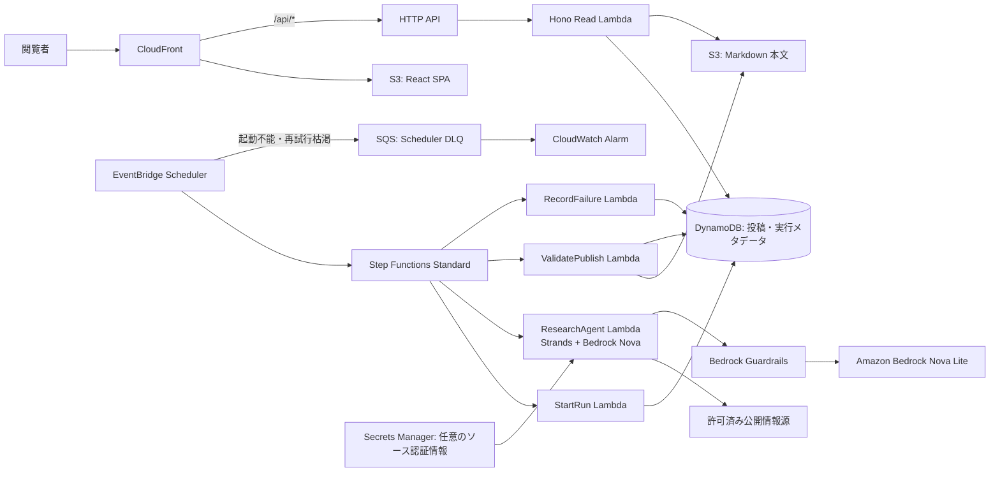
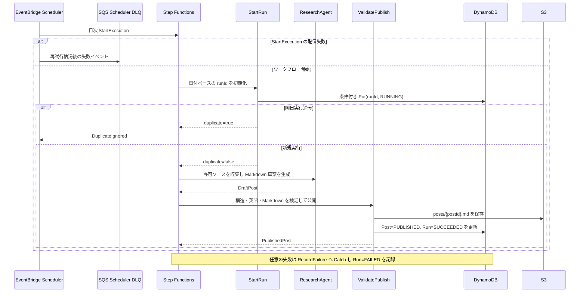
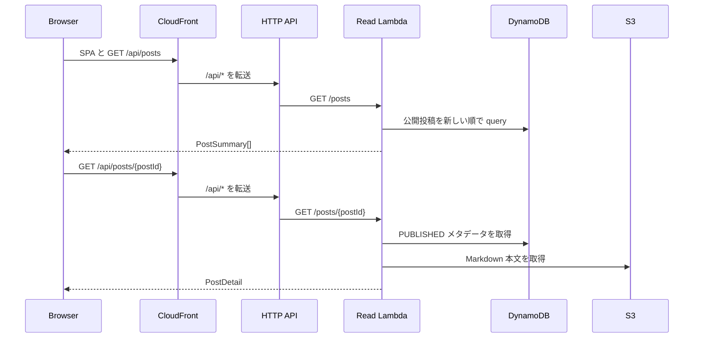
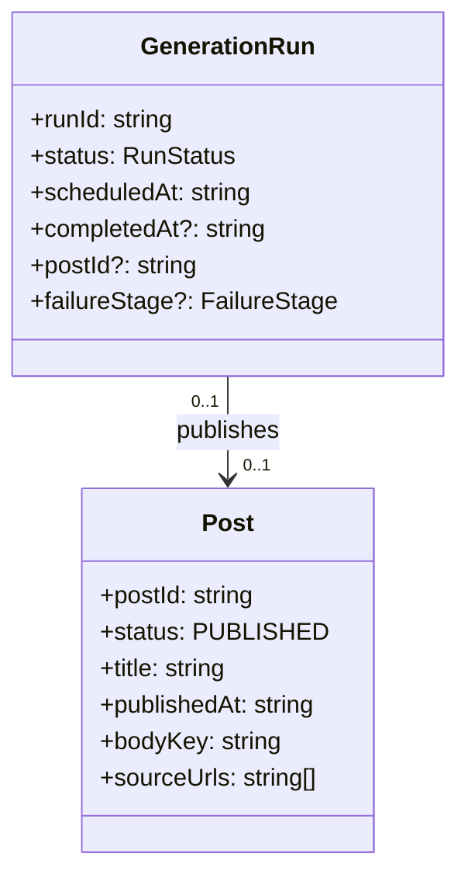

# 技術設計書

## Overview

本機能は、AWS Community Builder 向けの着想を日次で自律生成し、英語 Markdown のブログ形式で閲覧可能にする。利用者が開始する経路は持たず、定期スケジュール、状態機械、エージェント、保存、読み取り専用 UI を分離して、生成の成功・失敗を追跡可能にする。

対象ユーザーは Community Builder とチャレンジ提出者である。前者は最新のアイデアを閲覧して発信の下書きに使い、後者は定期実行と生成物の証跡、配備方法、提出記事を用いて要件適合を示す。現在の React/Vite、Hono Lambda、CDK 雛形を拡張するが、既存の公開 API は置き換えない。

### Goals

- 日次の自律実行で、英語 Markdown の投稿を安全に生成・公開する。
- 最新投稿、過去投稿、実行状態をブラウザで参照可能にする。
- 単一の CDK 配備と削除で、アプリケーション資源、ログ、秘密情報を一貫して管理する。
- 生成・公開・失敗を型付きの契約と自動テストで検証する。

### Non-Goals

- ログイン、利用者別設定、投稿の共同編集、手動生成ボタン。
- 外部検索サービスへの課金契約や、任意 Web サイト全体のクロール。
- 複数環境・複数 AWS アカウントにまたがる配備基盤。

## Boundary Commitments

### This Spec Owns

- 日次スケジュールから投稿公開までの自律生成パイプラインと実行証跡。
- 投稿本文、投稿メタデータ、実行メタデータのデータ契約。
- 投稿・実行状態を取得する公開読み取り API と React の表示状態。
- CDK の構成、運用ログ、提出資料の配置・生成方針。

### Out of Boundary

- アカウント認証と利用者データの保存。
- 投稿への書込み・編集・削除を行う公開 API。
- エージェントの長期記憶、個人設定、通知配信。

### Allowed Dependencies

- EventBridge Scheduler、Step Functions Standard、Lambda、Amazon Bedrock、DynamoDB、S3、API Gateway HTTP API、CloudFront、Secrets Manager、CloudWatch Logs。
- `@strands-agents/sdk`、AWS SDK v3、Hono、React、Tailwind CSS、Markdown 描画ライブラリ、Zod。
- 外部情報源は設定された HTTPS の公開許可リストのみとし、認証情報を必要とするソースは Secrets Manager の任意シークレット経由に限定する。

### Revalidation Triggers

- 投稿・実行・API レスポンスの型または API パスを変更する場合。
- S3 と DynamoDB のデータ所有・公開状態遷移を変更する場合。
- モデル ID、リージョン、外部ソース、スケジュール時刻を変更する場合。
- Web/API/ワークフローのネットワーク境界または IAM 権限を変更する場合。

## Architecture

### Existing Architecture Analysis

既存 `apps/frontend` は Vite の React 単一画面、`apps/backend` は Hono を `hono/aws-lambda` で Lambda ハンドラーへ変換する雛形、`apps/cdk` は単一 `CdkStack` の雛形である。したがって、UI・API・インフラを別アプリケーションとして保ち、バックエンドの HTTP ハンドラーとワークフロー用ハンドラーを別モジュールに分離する。既存の `GET /` の疎通確認エンドポイントは `/health` に移して、投稿 API の名前空間と混在させない。

### Architecture Pattern & Boundary Map

**選択パターン**: スケジュール起点のサーバーレス・オーケストレーション。ワークフローが書込みを所有し、Web/API は公開済みデータだけを読む。これは自律性、障害の可視性、公開前検証を最小構成で両立する。



- **境界**: `ResearchAgent` は外部取得・生成だけ、`ValidatePublish` は内容検証と公開状態遷移だけ、`Read API` は公開済みデータの取得だけを担当する。
- **既存パターンの維持**: React/Vite、Hono Lambda、CDK の用途別アプリ境界、TypeScript strict、相対 import を維持する。
- **新コンポーネントの理由**: 状態機械は日次フローの再試行・分岐を表し、S3/DynamoDB 分離は本文と一覧・証跡のアクセス特性を分ける。
- **ステアリング準拠**: 論理 ID と資源オプションは型付き外部設定に集約し、公開コード・ログ・クライアント応答に秘密値を含めない。

### Technology Stack & Alignment

| Layer | Choice / Version | Role in Feature | Notes |
|---|---|---|---|
| Frontend | React 19, Vite 8, Tailwind CSS, Markdown renderer | 投稿・実行証跡の表示 | 生 HTML はレンダリングしない |
| API | Hono 4, `hono/aws-lambda`, API Gateway HTTP API | 公開読み取り API | 書込み API は提供しない |
| Agent | Node.js 20, Strands Agents SDK, Bedrock Nova Lite, Guardrails | 情報の選定と英語 Markdown 生成 | 外部本文は非信頼入力として検査 |
| Workflow | EventBridge Scheduler, Step Functions Standard | 日次起動、再試行、失敗分岐 | JST cron と冪等実行 |
| Storage | DynamoDB on-demand, S3 | メタデータ/実行証跡と Markdown 本文 | 投稿公開を整合性の境界とする |
| Infrastructure | CDK v2, cdk-nag | 単一 Stack の合成と検査 | L2 Construct を第一選択 |

## File Structure Plan

### Directory Structure

```text
apps/
├── backend/src/
│   ├── api/                 # Hono ルート、レスポンス DTO、入力検証
│   ├── generation/          # ソース収集、Strands 実行、Markdown 検証・公開
│   ├── workflow/            # Step Functions から呼ぶ Lambda ハンドラー
│   └── shared/              # 投稿・実行・エラーの共通型と AWS クライアント
├── frontend/src/
│   ├── api/                 # 読み取り API クライアントと DTO
│   ├── components/          # 投稿リスト、本文、実行状態の表示部品
│   └── types/               # UI 専用の明示的な型
└── cdk/lib/
    ├── config/              # 環境設定、論理 ID、ソース許可リスト
    ├── constructs/          # Web、ストア、API、生成ワークフローの Construct
    └── stacks/              # Construct を合成する CreativeAgentStack
docs/
└── architecture.drawio      # AWS アイコンを使うアーキテクチャ図
articles/
└── weekend-creative-agent-challenge.md  # Builder Center 投稿原稿
```

### Modified Files

- `apps/backend/src/index.ts` — Hono アプリの組立てを API ルートへ移し、`/health` と読み取り API を公開する。
- `apps/frontend/src/App.tsx` — 投稿一覧・本文・実行証跡を表示するアプリケーション画面に置き換える。
- `apps/cdk/bin/cdk.ts` — 型付き環境設定を読み込み、`CreativeAgentStack` を生成する。
- `apps/cdk/lib/cdk-stack.ts` — 雛形 Stack を廃止し、Stack 合成の責務を `stacks/` へ移す。
- 各 `package.json` — 設計で選択した依存関係と一括ビルド・テスト・CDK 配備スクリプトを追加する。
- `README.md` — 概要、図、セットアップ、ビルド、配備、利用、削除手順を追加する。

## System Flows

### 日次生成・公開フロー



Scheduler は最大イベント保持時間と再試行回数を明示し、起動できなかったイベントを SQS DLQ に保存してアラームを発報する。ワークフロー開始後の外部取得とモデル呼出しは指数バックオフで最大 2 回再試行する。`StartRun` は同一の `runId` への条件付き書込みを唯一の冪等境界とし、`ValidatePublish` は S3 本文の保存後、DynamoDB トランザクションで投稿公開と実行成功を同時に確定する。失敗した草案は公開しない。

### 閲覧フロー



## Requirements Traceability

| Requirement | Summary | Components | Interfaces | Flows |
|---|---|---|---|---|
| 1.1–1.4 | 日次自律実行・重複抑止 | Scheduler, StateMachine, StartRun | `ScheduledGenerationInput`, `StartRunResult` | 日次生成 |
| 2.1–2.4 | 収集・選定・草案生成 | ResearchAgent, SourceCollector | `SourceDocument`, `DraftPost` | 日次生成 |
| 3.1–3.4 | 英語 Markdown と公開判定 | MarkdownValidator, ValidatePublish | `DraftPost`, `PublishedPost` | 日次生成 |
| 4.1–4.4 | 最新・履歴・空状態の閲覧 | Read API, React UI | `GET /api/posts`, `GET /api/posts/{id}` | 閲覧 |
| 5.1–5.4 | 実行状態と証跡 | RunRepository, RunStatusPanel | `GenerationRun`, `GET /api/runs/latest` | 両方 |
| 6.1–6.4 | 秘密情報と入力の安全性 | IAM, Secrets boundary, renderer | `AppConfig`, validation schemas | 日次生成・閲覧 |
| 7.1–7.4 | AWS 資源の一括管理 | CreativeAgentStack, CDK config | `AppConfig`, Construct props | 配備 |
| 8.1–8.4 | 監視・品質検査 | Log groups, CDK assertions, CI scripts | structured log schema | 日次生成 |
| 9.1–9.4 | README と図 | Documentation assets | README 手順 | 配備 |
| 10.1–10.4 | 提出記事と証跡 | Article asset, public URL outputs | article front matter | 提出 |

## Components & Interfaces

| Component | Domain/Layer | Intent | Req Coverage | Key Dependencies | Contracts |
|---|---|---|---|---|---|
| Scheduler | Event | 日次起動を一度だけ要求 | 1.1, 1.4, 7.1 | StateMachine (P0) | Event |
| StartRun | Workflow | 実行記録と冪等性を確立 | 1.2, 1.3, 5.1 | RunRepository (P0) | Batch, State |
| ResearchAgent | Generation | 許可ソースから草案を生成 | 2.1–2.4, 3.1 | SourceCollector, Bedrock (P0) | Service, Batch |
| ValidatePublish | Generation | 草案を検証して投稿を公開 | 3.2–3.4, 5.2 | S3, PostRepository (P0) | Service, Batch |
| RecordFailure | Workflow | 実行失敗を記録 | 2.4, 5.3, 8.1 | RunRepository (P0) | Batch |
| Read API | API | 公開投稿と最新実行を返す | 4.1–4.4, 5.4, 6.3 | S3, DynamoDB (P0) | API |
| Web UI | UI | Markdown と状態を安全に表示 | 4.1–4.4 | Read API (P0) | State |
| CDK Constructs | Infrastructure | 資源、権限、削除ポリシーを合成 | 6.1–6.2, 7.1–7.4, 8.2–8.3 | AWS CDK (P0) | Service |

### Generation Domain

#### StartRun / RunRepository

| Field | Detail |
|---|---|
| Intent | 日次 run の作成、重複判定、状態遷移を唯一の場所で管理する。 |
| Requirements | 1.2, 1.3, 5.1, 5.4 |

**Responsibilities & Constraints**

- `runId` は設定済みタイムゾーンにおける `YYYY-MM-DD` とし、同日の実行を一意にする。
- `RUNNING → SUCCEEDED | FAILED | DUPLICATE` 以外の遷移を拒否する。
- DynamoDB の条件式により、同一 `runId` の初期化を一回だけ許可する。

**Dependencies**

- Inbound: StateMachine — スケジュール入力 (Critical)
- Outbound: DynamoDB — 実行メタデータ (Critical)

**Contracts**: Service [x] / API [ ] / Event [ ] / Batch [x] / State [x]

##### Service Interface

```typescript
type RunStatus = "RUNNING" | "SUCCEEDED" | "FAILED" | "DUPLICATE";

interface StartRunInput {
  scheduledAt: string;
  scheduleName: string;
}

interface StartRunResult {
  runId: string;
  isDuplicate: boolean;
}

interface RunRepository {
  start(input: StartRunInput): Promise<StartRunResult>;
  complete(runId: string, postId: string): Promise<void>;
  fail(runId: string, error: GenerationError): Promise<void>;
}
```

- Preconditions: `scheduledAt` は ISO 8601、`scheduleName` は設定済みスケジュール名。
- Postconditions: `start` は実行記録を作成するか、既存実行を `isDuplicate=true` で返す。
- Invariants: 状態と時刻は実行記録に必ず保存し、`postId` は成功時だけ設定する。

#### ResearchAgent / SourceCollector

| Field | Detail |
|---|---|
| Intent | 公開許可ソースを取得し、Strands/Nova で英語 Markdown 草案を生成する。 |
| Requirements | 2.1–2.4, 3.1, 6.2, 6.4 |

**Responsibilities & Constraints**

- 外部 URL は `AppConfig.allowedSourceOrigins` の HTTPS オリジンだけを許可する。
- 取得本文は一件ごとと合計の文字数上限、タイムアウト、content-type 検査を適用する。
- 外部本文は命令ではない非信頼データとして専用の入力フィールドに隔離し、システム指示・ツール定義・秘密値と混在させない。エージェントは外部書込みツールを持たない。
- Bedrock Guardrails の prompt-attack 検査を外部本文に適用し、検査に失敗したソースは草案入力から除外する。生成結果にも Guardrails と構造検証を適用する。
- プロンプトは「英語、Markdown、タイトル、本文、具体的アイデア、出典」を要求し、モデル出力を未検証のまま公開しない。
- AWS SDK/Bedrock クライアントは Lambda 初期化時に一度だけ作る。

**Dependencies**

- Inbound: StateMachine — `runId` (Critical)
- Outbound: HTTPS source origins — 候補情報 (Critical)
- External: Strands Agents SDK / Amazon Bedrock Nova Lite / Guardrails — 草案生成と入出力検査 (Critical)
- External: Secrets Manager — 任意の外部ソース認証情報 (Conditional)

**Contracts**: Service [x] / API [ ] / Event [ ] / Batch [x] / State [ ]

##### Service Interface

```typescript
interface SourceDocument {
  url: string;
  title: string;
  excerpt: string;
  publishedAt?: string;
}

interface DraftPost {
  runId: string;
  title: string;
  markdown: string;
  sourceUrls: readonly string[];
  generatedAt: string;
}

interface ResearchAgent {
  generate(runId: string): Promise<DraftPost>;
}
```

- Preconditions: 実行は `RUNNING`、許可ソース設定とモデル ID が存在する。
- Postconditions: 十分な候補と必須フィールドを満たす `DraftPost`、または分類済み失敗を返す。
- Invariants: シークレット値と生の HTTP レスポンス全文をログ・草案に含めない。Guardrails が prompt attack と判定した入力・出力は公開しない。

#### ValidatePublish / PostRepository

| Field | Detail |
|---|---|
| Intent | 草案を型・内容・安全性で検査し、Markdown と公開メタデータを永続化する。 |
| Requirements | 3.2–3.4, 5.2, 6.4 |

**Responsibilities & Constraints**

- Zod スキーマでタイトル、Markdown、URL、時刻を検査し、Markdown は HTML を許さない。
- 英語判定、空文字、必要な見出し・具体的アイデア、許可 URL を検証する。
- S3 への本文保存が成功した後に、DynamoDB `TransactWriteItems` で投稿を `PUBLISHED`、対応する実行を `SUCCEEDED` に同時更新する。

**Dependencies**

- Inbound: StateMachine — `DraftPost` (Critical)
- Outbound: S3 — Markdown 本文 (Critical)
- Outbound: DynamoDB — 投稿と実行メタデータ (Critical)

**Contracts**: Service [x] / API [ ] / Event [ ] / Batch [x] / State [x]

##### Service Interface

```typescript
interface PublishedPost {
  postId: string;
  title: string;
  publishedAt: string;
  sourceUrls: readonly string[];
}

interface PostRepository {
  publish(draft: DraftPost): Promise<PublishedPost>;
  listPublished(limit: number): Promise<readonly PostSummary[]>;
  getPublished(postId: string): Promise<PostDetail | null>;
}
```

- Preconditions: `DraftPost` が検証済みで、`runId` が RUNNING。
- Postconditions: S3 の `posts/{postId}.md` と PUBLISHED 投稿メタデータ、SUCCEEDED 実行記録が揃う。
- Invariants: 投稿公開と実行成功は一つの DynamoDB トランザクションで確定する。S3 保存・トランザクション更新の途中失敗では公開投稿を作らない。

#### StateMachine / RecordFailure

| Field | Detail |
|---|---|
| Intent | スケジュール実行の段階、再試行、失敗の終端を可視化する。 |
| Requirements | 1.1, 2.4, 5.1, 5.3, 8.1 |

**Batch / Job Contract**

- Trigger: EventBridge Scheduler の JST 日次 cron。入力は `scheduledAt` と `scheduleName` のみ。起動に失敗したイベントは、再試行枯渇後に SQS DLQ へ送る。
- Input / validation: `StartRun` が日時から `runId` を正規化し、重複時は正常終了する。
- Output / destination: 成功時は `PublishedPost`、失敗時は `GenerationError` を実行記録へ保存する。
- Idempotency & recovery: Scheduler の失敗は DLQ と CloudWatch Alarm、ワークフロー開始後の失敗は `RecordFailure` で扱う。取得・生成・保存は指数バックオフで最大 2 回再試行し、再実行は同じ `runId` で重複公開しない。

### API and UI Domain

#### Read API

| Field | Detail |
|---|---|
| Intent | PUBLISHED 投稿と最新実行状態だけを JSON で返す。 |
| Requirements | 4.1–4.4, 5.4, 6.3 |

**Responsibilities & Constraints**

- Hono のルートは API Gateway HTTP API からの GET だけを受ける。API は認証なしの公開読み取りエンドポイントであり、CloudFront の同一オリジン `/api/*` 経由を正規の利用経路とする。
- クエリ上限を 20 件、`postId` を UUID 形式に制限する。
- 内部エラー、S3 キー、IAM 情報、スタックトレースを応答に含めない。
- HTTP API Stage の route-level throttling と Read Lambda の予約同時実行数を設定し、想定外の直接アクセスでワークロード全体を枯渇させない。CORS はアクセス制御として扱わず、同一オリジン利用のため不要な許可ヘッダーを返さない。

**Contracts**: Service [ ] / API [x] / Event [ ] / Batch [ ] / State [ ]

##### API Contract

| Method | Endpoint | Request | Response | Errors |
|---|---|---|---|---|
| GET | `/health` | なし | `{ status: "ok" }` | 503 |
| GET | `/api/posts?limit=10` | `limit`: 1–20、省略時 10 | `PostSummary[]` | 400, 500 |
| GET | `/api/posts/{postId}` | UUID の path parameter | `PostDetail` | 404, 500 |
| GET | `/api/runs/latest` | なし | `GenerationRun` | 404, 500 |

```typescript
interface PostSummary {
  postId: string;
  title: string;
  publishedAt: string;
}

interface PostDetail extends PostSummary {
  markdown: string;
  sourceUrls: readonly string[];
}

interface GenerationRun {
  runId: string;
  status: RunStatus;
  scheduledAt: string;
  completedAt?: string;
  postId?: string;
  failureStage?: "START" | "RESEARCH" | "VALIDATE_PUBLISH";
}
```

#### Web UI

| Field | Detail |
|---|---|
| Intent | 読み取り API の状態を、最新投稿を中心に安全に表示する。 |
| Requirements | 4.1–4.4, 5.4, 6.4 |

**State Management**

- State model: `loading | ready | empty | error` の投稿状態と、最新実行状態を分離する。
- Persistence & consistency: UI はサーバーを正とし、ブラウザ永続キャッシュを要件としない。
- Concurrency strategy: 初回並列取得のうち投稿取得を主経路とし、実行状態取得失敗は投稿表示を阻害しない。

**Implementation Notes**

- Markdown renderer は HTML をエスケープし、許可したプロトコルのリンクだけを描画する。
- Tailwind CSS は表示層だけに利用し、API 型を UI コンポーネントに複製しない。

### Infrastructure Domain

#### CreativeAgentStack と構成モデル

| Field | Detail |
|---|---|
| Intent | 全資源、最小権限、削除ポリシー、配備出力を単一の CDK Stack に合成する。 |
| Requirements | 6.1–6.2, 7.1–7.4, 8.2–8.3, 9.4 |

**Responsibilities & Constraints**

- `AppConfig` はリージョン、モデル ID、JST cron、ソース許可リスト、ログ保持、削除ポリシーを型付きで提供する。値は環境別設定ファイルから読み込み、秘密値そのものは置かない。
- `ResourceIds` は Construct とリソースの CDK ID を一箇所に置く。物理名は生成に委ね、安定した論理 ID を変更しない。
- `ContentStore` は S3 のブロックパブリックアクセス、暗号化、SSL 強制と DynamoDB のオンデマンド・暗号化・ポイントインタイムリカバリを設定する。
- `WebDelivery` は CloudFront Origin Access Control だけが Web バケットを読めるようにし、`/api/*` は HTTP API に振り分ける。
- `GenerationWorkflow` は Scheduler の `StartExecution`、retry policy、SQS DLQ、DLQ/起動失敗アラーム、StateMachine、各 Lambda、明示したロググループ、最小権限の IAM ロールを生成する。
- `PublicApi` は GET ルートだけを公開し、HTTP API Stage のスロットリング、Read Lambda の予約同時実行数、CloudFront の `/api/*` キャッシュ無効ポリシーを設定する。CORS はアクセス制御に使わない。
- チャレンジ環境の全資源は `DESTROY` と、S3 の `autoDeleteObjects`、ログの明示的な削除を設定する。これは本番には適用しない。

**Contracts**: Service [x] / API [ ] / Event [x] / Batch [ ] / State [ ]

##### Service Interface

```typescript
interface AppConfig {
  readonly environment: "challenge";
  readonly timezone: "Asia/Tokyo";
  readonly scheduleExpression: string;
  readonly bedrockModelId: string;
  readonly allowedSourceOrigins: readonly string[];
  readonly logRetentionDays: number;
}

interface CreativeAgentStackProps {
  readonly config: AppConfig;
}
```

## Data Models

### Domain Model

`GenerationRun` は日次実行のライフサイクルを表す集約、`Post` は公開済み Markdown の集約である。公開の整合性境界は `Post.status === "PUBLISHED"` であり、API はこの状態以外を返さない。`SourceDocument` は生成時だけ使う値で、公開契約には URL だけを残す。



### Physical Data Model

**DynamoDB `ContentTable`**

| Item | PK | SK | 主な属性 | Access pattern |
|---|---|---|---|---|
| 実行記録 | `RUN#{runId}` | `METADATA` | status, scheduledAt, completedAt, postId, failureStage | runId の取得、最新実行 GSI |
| 投稿メタデータ | `POST#{postId}` | `METADATA` | status, title, publishedAt, bodyKey, sourceUrls | postId の取得、公開投稿 GSI |

- `GSI1PK = "PUBLISHED"`, `GSI1SK = publishedAt` により、投稿を新しい順で取得する。
- `GSI2PK = "RUN"`, `GSI2SK = scheduledAt` により、最新実行を取得する。
- 条件付き Put は `attribute_not_exists(PK)` を用い、`RUN#{runId}` の重複開始を防ぐ。
- `TransactWriteItems` は、投稿の `PUBLISHED` 化と対応する実行の `SUCCEEDED` 化を同一トランザクションで確定する。

**S3 `ContentBucket`**

- `posts/{postId}.md`: 公開済みの Markdown 本文。
- `artifacts/{runId}/draft.json`: 検証失敗時のみ調査用に保存できる非公開草案。保持を有効化する場合は短期ライフサイクルを設定する。
- バケットは公開せず、CloudFront は UI バケットだけを読む。ContentBucket は Read Lambda と Publish Lambda のみがアクセスする。

### Data Contracts & Integration

- JSON API は camelCase、日時は ISO 8601 UTC、ID は UUID とする。
- `DraftPost` は Lambda/StateMachine 間の内部 JSON 契約で、Zod スキーマの parse に成功した値のみ後続状態へ渡す。
- API 契約に破壊的変更が必要な場合は、新しいバージョンパスを先に追加して UI を移行する。

## Error Handling

### Error Strategy

外部ソース取得、Bedrock 呼出し、S3/DynamoDB 書込みを分類した `GenerationError` として扱う。回復可能な外部失敗は StateMachine が再試行し、最終失敗と検証失敗は `RecordFailure` が `GenerationRun` に安全な要約だけを記録する。クライアントは内部原因を受け取らず、投稿を表示できない場合は再試行可能な案内を表示する。

### Error Categories and Responses

| Category | 例 | Workflow response | Public API / UI response |
|---|---|---|---|
| 入力・設定 | 無効な URL、モデル ID 未設定 | 再試行せず FAILED を記録 | 500、内部詳細は非公開 |
| 外部一時障害 | タイムアウト、Bedrock throttling | 指数バックオフで最大 2 回再試行 | 最終失敗時も既存投稿を表示 |
| 内容検証 | 英語でない、空の Markdown、危険な HTML | 非公開で FAILED を記録 | 新規投稿なし、状態を表示 |
| prompt attack | 取得本文による命令上書き、危険な出力 | Guardrails で除外し FAILED を記録 | 新規投稿なし、状態を表示 |
| 永続化 | S3 または DynamoDB 失敗 | 再試行後に FAILED を記録。投稿・実行の更新はトランザクションで原子的に行う | 部分投稿を返さない |
| Scheduler 配信 | StartExecution の権限・設定・一時障害 | retry 後に SQS DLQ とアラームへ送る | 既存投稿を表示 |
| API | 不正 `limit`、不存在 ID | 該当なし | 400 / 404 の定型 JSON |

### Monitoring

- 各 Lambda と StateMachine に明示した CloudWatch Logs を設定し、構造化ログは `runId`、stage、status、durationMs、errorCode を含める。
- Scheduler の `InvocationAttemptCount`、`TargetErrorCount`、DLQ 送信、StateMachine の FAILED、Publish Lambda の error を検知できるメトリクスとアラームを定義する。
- ログには Markdown 本文、秘密値、外部 HTTP レスポンス全文を出力しない。

## Testing Strategy

- **Unit**: `runId` 正規化と重複判定、ソース許可リスト、Guardrails 拒否時の草案中断、草案 Zod 検証、Markdown 無害化、投稿公開状態遷移をテストする。
- **API integration**: `GET /api/posts` の新しい順、投稿詳細の S3 本文結合、空状態、非公開・不存在投稿の拒否をテストする。
- **Workflow integration**: 新規 run の成功、重複 run の正常終了、外部取得失敗の再試行・FAILED 記録、Guardrails 拒否時の非公開、S3 保存後の DynamoDB トランザクション失敗をテストする。
- **CDK assertions**: Scheduler→StateMachine 権限、Scheduler retry policy、SQS DLQ とアラーム、S3 非公開/暗号化、DynamoDB 暗号化とトランザクション権限、読み取り・書込み IAM 分離、HTTP API の GET 限定・スロットリング、Read Lambda 予約同時実行数、ログ保持/削除、CloudFront OAC、全 Construct の存在をテストする。
- **UI**: 最新投稿、投稿選択、Markdown の見出し/リスト/リンク、空状態、実行失敗の表示を E2E またはコンポーネントテストで確認する。

## Security Considerations

- 書込み権限は StateMachine が呼ぶ Lambda だけに付与し、Read Lambda は DynamoDB/S3 の読み取りだけを持つ。
- S3 は Block Public Access、暗号化、SSL 強制を有効にし、UI バケットは CloudFront Origin Access Control のみを許可する。
- API は GET のみの認証なし公開読み取り API とする。CORS はブラウザの制約でありアクセス制御には使わない。HTTP API の route-level throttling、Read Lambda の予約同時実行数、入力上限により直接アクセスの影響を限定する。将来の認証導入時は API 契約を分離して再評価する。
- 外部取得本文は untrusted context としてシステム指示から分離し、Bedrock Guardrails の prompt-attack 検査を入力・生成結果に適用する。Guardrails 拒否・検査不能時は投稿しない。
- Secrets Manager は任意のソース認証情報を保持し、CDK 設定・ログ・ブラウザへ値を渡さない。
- CDK Nag を Aspects として実行し、チャレンジ環境で不可避の例外は理由付きで最小限に抑える。

## Performance & Scalability

- 日次 1 実行、UI は最大 20 件一覧のため、DynamoDB on-demand と Lambda の自動スケールで十分とする。
- 外部入力を小さく正規化し、Step Functions の入力・出力上限を超えないようにする。大きな草案は S3 参照に切り替える。
- CloudFront は UI アセットをキャッシュし、投稿 API は更新直後の表示を優先するため長いキャッシュを設定しない。

## Supporting References

- 詳細な選定根拠と公式資料は [research.md](./research.md) を参照する。
