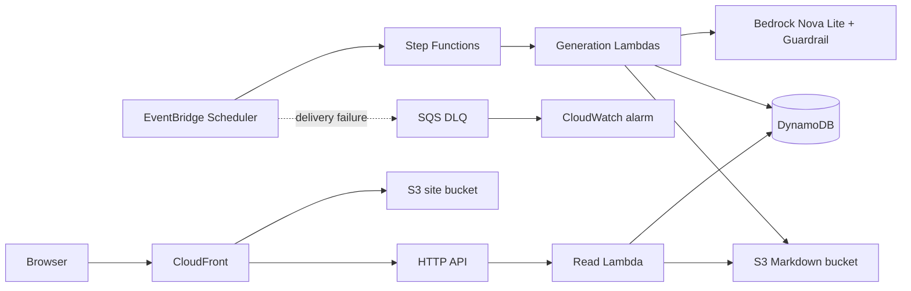

# Community Builder Desk

Community Builder Desk is an always-on creative agent for AWS Community Builders. Every morning it gathers permitted AWS-community sources and publishes one English Markdown idea for a post or application. The browser UI is read-only: people return to a finished idea rather than initiating generation.

## Architecture

The AWS-icon draw.io source is [docs/community-builder-desk-architecture.drawio](docs/community-builder-desk-architecture.drawio). Open it in [diagrams.net](https://app.diagrams.net/).



The Scheduler runs at 09:00 JST. Step Functions creates or deduplicates the daily run, researches and drafts, validates and publishes, or records a classified failure. Lambda applies Amazon Bedrock Guardrails before publishing. DynamoDB stores run/post metadata and private S3 stores Markdown bodies. CloudFront serves the static React UI and read-only `/api/*` routes.

## Prerequisites

- Node.js 20+ and pnpm 10
- AWS CLI credentials for `ap-northeast-1`
- AWS CDK bootstrapped in the target account

No secrets are committed. The supplied configuration uses allow-listed public sources and `amazon.nova-lite-v1:0`.

## Setup and verify

```bash
corepack enable
pnpm install
pnpm --filter frontend build
pnpm run verify
pnpm run cdk:diff
```

## Deploy, use, and remove

```bash
pnpm --dir apps/cdk exec cdk bootstrap aws://ACCOUNT_ID/ap-northeast-1
pnpm --dir apps/cdk exec cdk deploy CreativeAgentStack
```

CDK prints `PublicUrl` and `StateMachineArn`. Open `PublicUrl` after CloudFront propagation. The published-content API is exposed through the distribution at `/api/posts`, `/api/posts/{postId}`, and `/api/runs/latest`.

```bash
pnpm --dir apps/cdk exec cdk destroy CreativeAgentStack
```

The stack uses destroy policies and auto-delete helpers for owned data. Destruction removes the Scheduler, workflow, Guardrail, DLQ, alarms, log groups, DynamoDB, buckets, API, and CloudFront distribution; CloudFront can take several minutes.

## Project assets

- `apps/frontend`: React/Vite UI
- `apps/backend`: Hono read API and workflow handlers
- `apps/cdk`: CDK infrastructure
- [docs/builder-center-article.md](docs/builder-center-article.md): Builder Center submission draft
